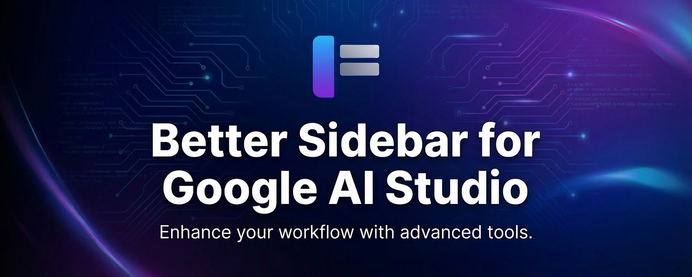

# Better Sidebar for Google AI Studio

Hi there! Welcome to the home of **Better Sidebar for Google AI Studio**.

If you use Google AI Studio heavily, you know the struggle: your chat list gets messy, old prompts get lost, and finding that *one* specific conversation from last week is a nightmare.

We built this extension to fix that. It gives you a clean, organized sidebar with folders, tags, and a powerful search engine that actually works—all while keeping your data 100% local and private.

## 🚀 What's New in v1.1.0?

This is our biggest update yet! We've introduced two powerful new modules and expanded platform support.

### 📝 Prompt Library (New Module)
A fully-featured prompt management system built right into your sidebar. The Prompt Library is designed to be your personal command center for prompt engineering.
*   **Variable Support**: Create dynamic templates using variables (e.g., `{{topic}}`, `{{language}}`). When you use the prompt, a form appears to fill in the values instantly.
*   **Organized Structure**: Keep your vast collection of prompts sorted with nested folders and colored tags. No more losing your best system prompts.
*   **Quick Access**: Insert your optimized prompts into any chat with just a click, streamlining your workflow.

### 🔍 Deep Search (New Module)
The search engine AI Studio deserves.
*   **Full-Text Indexing**: We don't just search titles. We index every single message in your history.
*   **Advanced Filtering**: Narrow down results by specific folders, tags, or even by role (User vs. Model) to find exactly what you said vs. what the AI generated.
*   **Instant Results**: Powered by a local search index for lightning-fast query times, even with thousands of messages.

### 🌐 Expanded Browser Support
We are bringing Better Sidebar to more users!
*   **Firefox**: Fully supported.
*   **Microsoft Edge**: Fully supported.

### ✨ Quality of Life Improvements
*   **Sidebar Shortcuts**: Added 3 dedicated buttons for AI Studio's native **Build**, **Dashboard**, and **Documentation** pages, making it easier to navigate the platform without disabling the extension.
*   **UI Optimization**: The "Switch to Original UI" button has been moved to a more convenient location outside the main list for better accessibility.
*   **General Polish**: Various bug fixes and performance improvements to make the experience smoother.

## ✨ Features

Here is what Better Sidebar can do for you:

| Feature | Description |
| :--- | :--- |
| 📂 **Folders** | Drag and drop your chats into nested folders. Keep your "Coding" separate from your "Creative Writing". |
| 📝 **Prompt Library** | **(New!)** Save, manage, and reuse your best prompts and templates locally with variable support. |
| 🔍 **Deep Search** | **(New!)** Full-text search across all your conversations. Filter by role, folder, or exact match. |
| 🏷️ **Tags** | Add custom tags to conversations for flexible filtering. |
| 📊 **Timeline View** | See your work organized by "Today", "Yesterday", and "Last Week". |
| ⭐ **Favorites** | Pin your most used chats or specific prompts to the top. |
| 🔒 **Privacy First** | Everything is stored locally in your browser (SQLite). We don't see your data, ever. |
| 🌗 **Theme Sync** | It looks like it belongs there. Automatically matches AI Studio's light/dark mode. |
| 💾 **Data Control** | Export your data (SQL dump) anytime. You own your data. |

## 🔒 Privacy & Security

We take this seriously.

*   **Local Only:** We use an embedded database (SQLite WASM) inside your browser.
*   **No Cloud:** Your folders, tags, and notes never leave your device.
*   **No Training:** We don't use your data to train models.

When you install, Chrome will say we can "Read and change data on aistudio.google.com". This is just so we can draw the sidebar on the page and read your chat titles to organize them. That's it.

## 🚧 Roadmap

We're just getting started. Here is what's on our mind:

- [x] **Full Content Search** (Done in v1.1.0!)
- [x] **Prompt Library** (Done in v1.1.0!)
- [ ] **Multi-Platform Support**: Maybe bring this to ChatGPT or Claude?
- [ ] **Cloud Sync**: Optional secure sync for those who work across multiple devices.
- [ ] **AI Auto-Tagging**: Using a local LLM to help organize your chats automatically.

## 📥 Installation

**[Get it from the Chrome Web Store](https://chrome.google.com/webstore/detail/your-extension-id)**

Also available on:
*   [Firefox Add-ons](https://addons.mozilla.org/en-US/firefox/addon/your-extension-id)
*   [Microsoft Edge Add-ons](https://microsoftedge.microsoft.com/addons/detail/your-extension-id)

## 🤝 Contributing

This project is now open source! If you're a developer and want to help make it better, feel free to open an issue or submit a PR.

## 🆘 Support & Troubleshooting

### Common Issues (FAQ)

<strong>1. The extension overlay isn't appearing.</strong>

*   **Refresh the page:** Sometimes the extension needs a page reload to inject properly, especially right after installation.
*   **Check permissions:** Ensure the extension has permission to run on `aistudio.google.com`.
*   **Conflict:** Disable other AI Studio extensions temporarily to check for conflicts.

<strong>2. My chats aren't showing up or I can't find specific messages.</strong>

*   **New chats missing?** Go to `Settings` -> `Data & Storage` and click **"Scan Library"**. This forces a sync with your AI Studio account.
*   **Missing message content?** If search can't find text from older chats, you might need to import them. Go to the **Search** tab and click **"Import History"**. You can upload a Google Takeout zip to fully index your past conversations.

<strong>3. I lost my folder structure!</strong>

*   **Don't Panic:** Your data is stored locally.
*   **Check Database:** In the `Settings`, try exporting your data to see if it's still there.
*   **Restore:** If you have a previous backup (SQL file), use the Import function to restore your state.

### Reporting Bugs

Found a bug? Have a cool idea?
*   Check the [Issues](../../issues) tab to see if it's already reported.
*   If not, feel free to open a new issue!

---

*Note: This is an independent project and is not affiliated with Google.*
