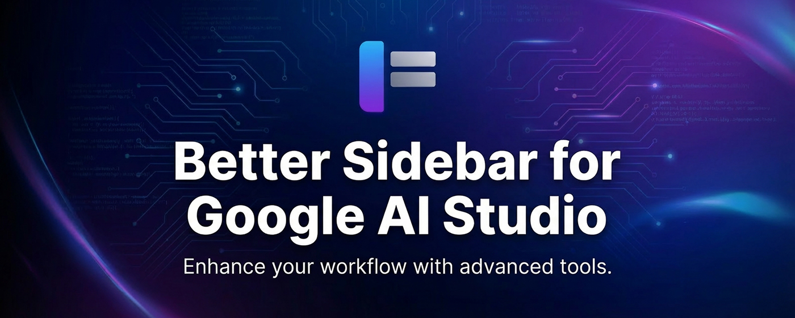

# Better Sidebar for Gemini & AI Studio

Hi there! Welcome to the home of **Better Sidebar for Gemini & AI Studio**.

If you use **Gemini** or **Google AI Studio** heavily, you know the struggle: your chat list gets messy, old prompts get lost, and finding that _one_ specific conversation from last week is a nightmare.

We built this extension to fix that. It gives you a clean, organized sidebar with folders, tags, and a powerful search engine that actually works across **both platforms**—all while keeping your data 100% local and private.

## 🚀 What's New in v2.8.0

### 🚀 Powerpack — Second Brain Integration

Export your conversations seamlessly to **Notion** and **Obsidian** with full formatting and code block preservation. Batch export multiple conversations at once. Coming soon: AI Agent Local Takeover. All paid packs come with a **7-day no-questions-asked refund**.

### ✂️ Snippets

Extract the best parts of any AI reply and save them to a dedicated Snippet library with folder management. Snippets can also be exported via the Powerpack.

### 📚 Revamped Sidebar

Completely rebuilt from the ground up — cleaner layout, better organization, and massively reduced animation lag. New additions include:
- **Conversation Outline** — see the structure of long chats at a glance
- **Chat Remarks** — add custom descriptions/notes to individual chats
- **Rich Tooltips** — hover to see creation date, description, and tags
- **Folder Pinning & Drag-to-Reorder** — pin favorite folders to the top
- **Locate Active Chat** — auto-expand and snap to your current conversation

### ⚡ Workflow Boosters

- **Default Homes for Gems & Notebooks** — new chats auto-sort into assigned folders
- **Magic Slash `/` Commands** — type `/` in Gemini to summon your Prompt Library
- **Batch Export** — select multiple conversations and export them all at once

### 🎨 Visuals & Themes

10 new exclusive themes for Supporter Pack. The changelog is now rendered in beautiful Markdown with browsable history.

---

## ✨ Features

Here is what Better Sidebar can do for you:

| Feature | Description |
| :--- | :--- |
| 🌟 **Multi-Platform Support** | Manage conversations across both Gemini and Google AI Studio seamlessly in one unified sidebar. |
| 👥 **Multi-Account Profiles** | Create separate profiles for work or personal use. Each maintains its own independent database. |
| 🔍 **Chained Search** | Filter conversations by combining multiple conditions — title, tag, and type — for laser-precise results. |
| 💎 **Gem Management** | Full Gem integration — browse, filter, create, and start conversations with your Gems right from the sidebar. |
| 📜 **Smart Scrollbar** | A visual scrollbar for Gemini conversations. Jump directly to any message in long chats. |
| 🤖 **Default Model** | Set a default model for Gemini and every new conversation will automatically use it. |
| ✏️ **True Rename** | Rename conversations directly — changes are synced to Google's servers in real time. |
| 🗑️ **True Delete & Batch Delete** | Delete or batch-delete conversations with real server-side removal. No more ghost chats. |
| 🔐 **Persistent Login** | Stay logged in across sessions with smart merge for synced data. |
| 📂 **Folders & Colors** | Drag and drop your chats into nested folders. Assign custom colors to folders and tags. |
| 📝 **Prompt Library** | Build your personal library of reusable prompts. Supports option variables, prompt composition, and system prompt imports. |
| 🔍 **Precision Search** | Full-text search across every message in your history. Limit search to the active chat for immediate context. |
| 📓 **Notebook Integration** | Full notebook support for Gemini — browse, organize, and manage your notebooks right from the sidebar. |
| ☁️ **Google Drive Auto Sync** | Automatically sync your settings, prompts, and config data to Google Drive in the background. Always backed up. |
| 🎨 **UI Customization** | Advanced layout controls for Gemini, including width adjustments and Focus Mode. |
| ⚙️ **Platform Manager** | Use the extension popup to quickly jump between platforms or enable/disable them on the fly. |
| 🏷️ **Smart Tagging** | Assign custom tags to your conversations, now visible directly in the chat header. |
| ⭐ **Favorites & Pinning** | Keep your most frequently used chats or specific prompts at the top for quick access. |
| 🔄 **Automatic Sync** | Your latest conversations are automatically synced behind the scenes when you visit the page. |
| 📊 **Timeline View** | Visualize your workflow with a "Today", "Yesterday", and "Last Week" timeline. |
| 🖼️ **Watermark-Free Downloads** | Automatically remove watermarks when downloading generated images in Gemini, including Pro HD images. |
| 📥 **Conversation Export** | Export your conversations as Markdown, Plain Text, or JSON for documentation or backup. |
| ✂️ **Snippets** | Extract highlights from any AI reply into a dedicated Snippet library with folder management. |
| 🔗 **Powerpack — Notion & Obsidian Export** | Seamlessly export conversations and snippets to Notion and Obsidian with full formatting preserved. Batch export supported. |
| 👀 **Conversation Outline** | See the structure of long conversations at a glance with the new Outline view. |
| 📝 **Chat Remarks & Rich Tooltips** | Add descriptions to chats; hover for creation date, tags, and notes. |
| 📌 **Folder Pinning** | Pin favorite folders to the top and drag-to-reorder for effortless organization. |
| 🎯 **Locate Active Chat** | One click to auto-expand and snap to your current active conversation in the tree. |
| ⚡ **Magic Slash Commands** | Type `/` in Gemini's input to instantly summon your Prompt Library. |
| 🏠 **Default Homes** | Assign default folders to Gems & Notebooks — new chats auto-sort themselves. |
| 🌗 **Theme Sync** | Automatically matches the platform's light/dark mode. |
| 🔒 **Privacy First** | Everything is stored locally in your browser (SQLite). We don't see your data, ever. |
| 💾 **Data Control** | Export your data (SQL dump) anytime. You own your data. |

## 🔒 Privacy & Security

We take this seriously.

- **100% Local:** We use an embedded SQLite database running entirely within your browser.
- **No Cloud Sync to Our Servers:** Your folders, tags, and notes are NOT sent to our servers. Google Drive sync is between you and your own Google account.
- **No Training:** We do not read your conversations to train any AI models.

When you install, your browser will request permission to "Read and change data on aistudio.google.com and gemini.google.com". This is solely to inject the enhanced sidebar interface and read chat titles for organization. We do not access your other browsing history.

## 🚧 Roadmap

We're just getting started. Here is what's on our mind:

- [x] **Full Content Search** (Done in v1.1.0!)
- [x] **Prompt Library** (Done in v1.1.0!)
- [x] **Gemini Platform Support** (Done in v2.0.0!)
- [x] **Multi-Account Support** (Done in v2.1.0!)
- [x] **Cloud Sync** (Done in v2.2.0!)
- [x] **Gem Management** (Done in v2.3.0!)
- [x] **Smart Scrollbar** (Done in v2.3.0!)
- [x] **True Rename & Delete** (Done in v2.4.0!)
- [x] **Notebook Integration** (Done in v2.5.0!)
- [x] **Auto Google Drive Sync** (Done in v2.5.0!)
- [x] **AI Studio UI Controls** (Done in v2.6.0!)
- [x] **Supporter Pack** (Done in v2.6.0!)
- [x] **Hotkey Support** (Done in v2.7.0!)
- [x] **AI-Generated Custom Themes** (Done in v2.7.0!)
- [x] **Powerpack — Notion & Obsidian Export** (Done in v2.8.0!)
- [x] **Snippets** (Done in v2.8.0!)
- [x] **Conversation Outline** (Done in v2.8.0!)
- [x] **Sidebar UI Rebuild** (Done in v2.8.0!)
- [ ] **AI Agent Local Takeover**: Let AI manage plugin data and act on your behalf (coming soon in Powerpack).
- [ ] **Additional Platform Support**: Maybe bring this to ChatGPT or Claude?
- [ ] **AI Auto-Tagging**: Using a local LLM to help organize your chats automatically.

## 📥 Installation

**[Get it from the Chrome Web Store](https://chromewebstore.google.com/detail/better-sidebar-for-google/cjeoaidogoaekodkbhijgljhenknkenj)**

Also available on:

- [Firefox Add-ons](https://addons.mozilla.org/en-US/firefox/addon/better-sidebar-for-ai-studio)
- **Microsoft Edge**: Not yet supported (coming soon).

## 🤝 Contributing

This project is now open source! If you're a developer and want to help make it better, feel free to open an issue or submit a PR.

## 🆘 Support & Troubleshooting

### Common Issues (FAQ)

<strong>1. The extension overlay isn't appearing.</strong>

- **Refresh the page:** Sometimes the extension needs a page reload to inject properly, especially right after installation.
- **Check permissions:** Ensure the extension has permission to run on `aistudio.google.com` and `gemini.google.com`.
- **Conflict:** Disable other Gemini or AI Studio extensions temporarily to check for conflicts.

<strong>2. My chats aren't showing up or I can't find specific messages.</strong>

- **New chats missing?** The extension automatically syncs when you visit the page. If conversations are still missing, go to `Settings` -> `Data & Storage` and click **"Scan Library"** to force a manual sync.
- **Missing message content?** If search can't find text from older chats, you might need to import them. Go to the **Search** tab and click **"Import History"**. You can upload a Google Takeout zip to fully index your past conversations.

<strong>3. I lost my folder structure!</strong>

- **Don't Panic:** Your data is stored locally.
- **Check Database:** In the `Settings`, try exporting your data to see if it's still there.
- **Restore:** If you have a previous backup (DB file), use the Import function to restore your state.

### Community

Join our [Discord server](https://discord.gg/FRzesxaGAx) to chat with other users, get help, or share feedback.

### Reporting Bugs

Found a bug? Have a cool idea?

- Check the [Issues](../../issues) tab to see if it's already reported.
- If not, feel free to open a new issue!

---

_Note: This is an independent project and is not affiliated with, endorsed by, or sponsored by Google._
